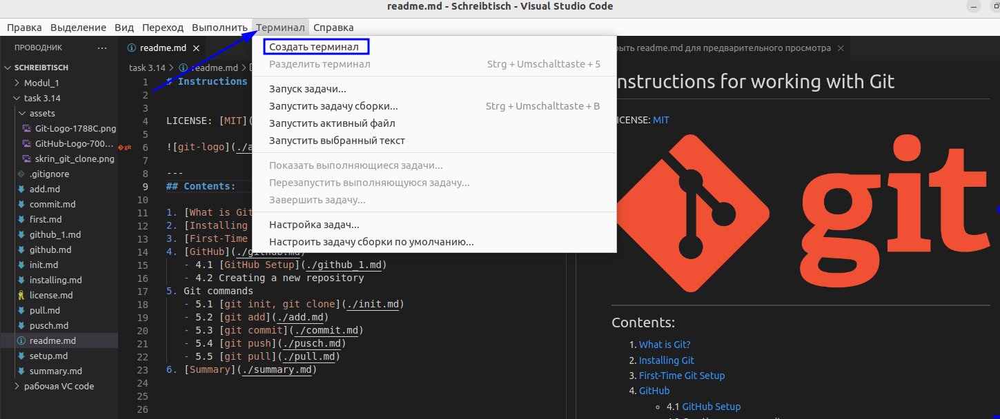
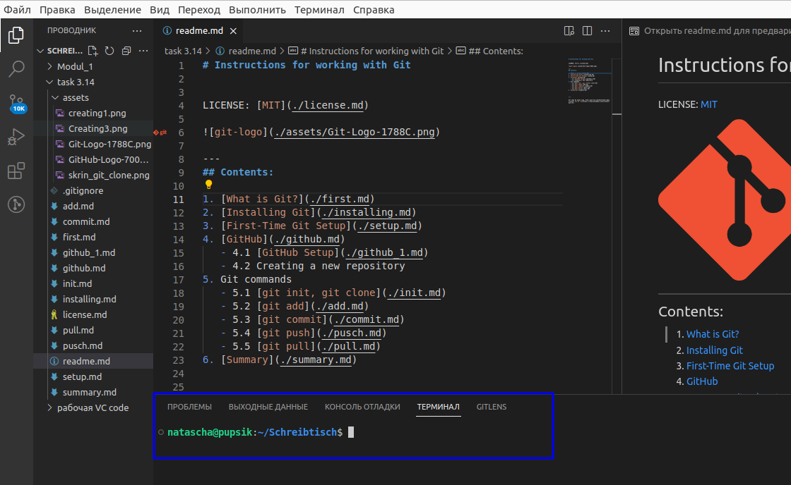
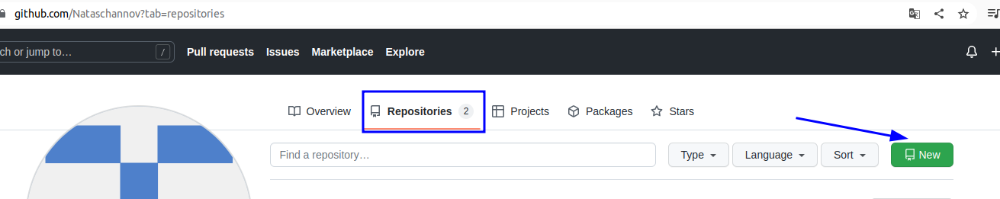
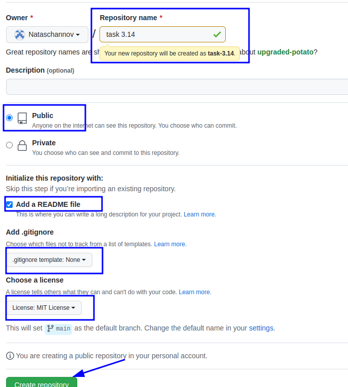
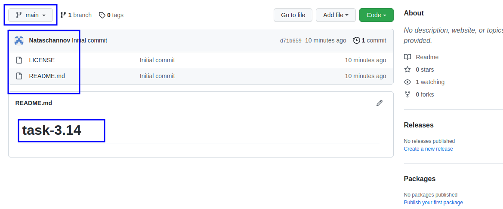

[< к содержанию](./readme.md)

## Создание нового репозитория на GitHub

### 1. Открыть Терминал в VScode

### 2. Загружается Терминал

### 3. На GitHub создаем новый репозиторий

### Мы создали удаленный репозиторий на GitHub

