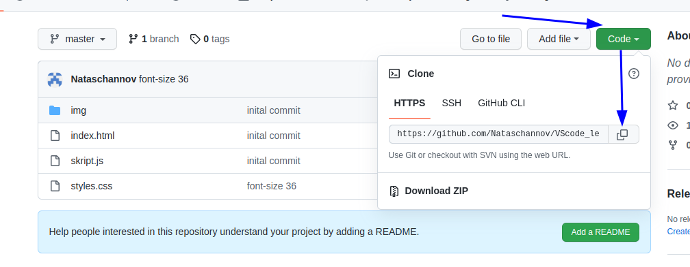

[< к содержанию](./readme.md)

## git init 

1. ### **git init *[папка]*** - превратить папку (my_project) в репозиторий Git 

        $ cd /home/user/my_project
        $ git init

При этом создается новый подкаталог с именем `.git`,   который содержит все необходимые файлы репозитория — скелет репозитория Git.   

2. ### **git clone *[ссылка на репозиторий]*** - клонирование существующего репозитория

- берем ссылку на существующий репозиторий в Github 

- прописываем в терминале команду:

        § git clone https://github.com/Nataschannov/VScode_lernen.git

- получаем клон-папку на компьютере как  **Локальный репозиторий**

