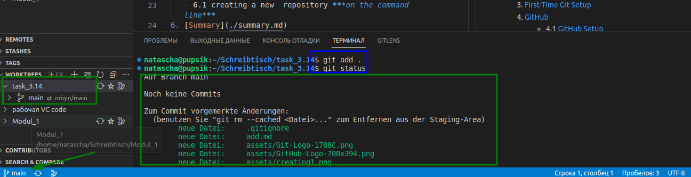
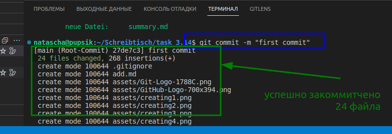
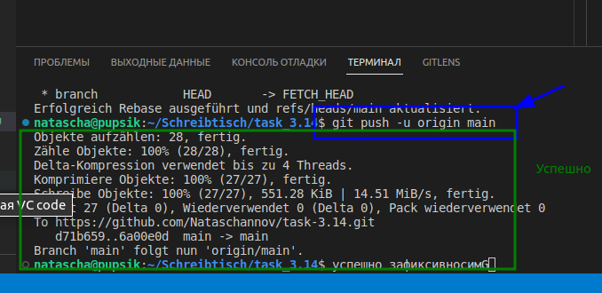
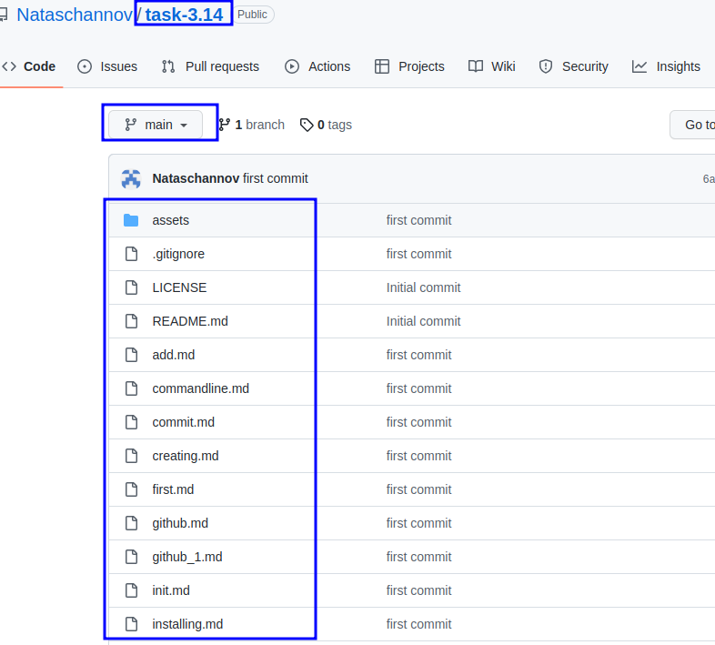

[< к содержанию](./readme.md)

## Перенос изменений в удаленный репозиторий

1. В открытом **Tерминале**  создаем с помощью команды `git init`  пустой ***Локальный репозиторий***

2. Вносим все наши изменения  в **Индекс**:

        $ git add 
    

3. Теперь фиксируем изменения в Индексес ключем -m и прописываем сообщение

        $ git commit -m "first commit"

Получаем сообщение об успешном коммите 24 файлов

4. Теперь мы готовы перейти в последнему шагу - перенос в удаленный репозиторий на GitHub

- И сначала нам нужно показать адрес, куда нужно отправить все содержимое Индекса:

        $ git remote add origin https://github.com/Nataschannov/task-3.14.git

 - теперь готовы отправлять:

        $  git push -u origin main

  

Успешно зафиксировано

5. Проверяем удаленный репозиторий на GitHub

Все наши файлы внесены

# ура !!!! :))))

